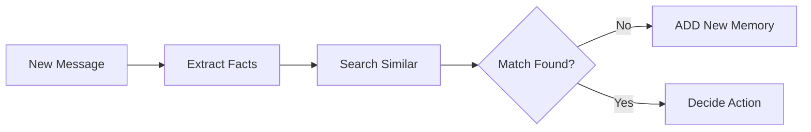

## Memory Types

PhotoMem supports three types of memories, each optimized for different use cases:

<CardGroup cols={3}>
  <Card title="Semantic" icon="brain">
    General knowledge and facts extracted from conversations
  </Card>
  <Card title="Episodic" icon="clock-rotate-left">
    Conversation-specific memories with temporal context
  </Card>
  <Card title="Procedural" icon="list-check">
    Step-by-step execution traces and agent workflows
  </Card>
</CardGroup>

### Semantic Memory (Default)

Stores factual information extracted from conversations.

<CodeGroup>

```python Python
from photomem import Memory
from photomem.core.types import MemoryType

memory = Memory()

# Semantic memory (default)
await memory.add(
    "I love Italian food, especially pizza",
    user_id="phone:15103651277",
    memory_type=MemoryType.SEMANTIC  # Optional, this is default
)
```

```typescript TypeScript
import { Memory, MemoryType } from 'photomem';

const memory = new Memory();

// Semantic memory (default)
await memory.add(
    'I love Italian food, especially pizza',
    {
        userId: 'phone:15103651277',
        memoryType: MemoryType.SEMANTIC  // Optional
    }
);
```

</CodeGroup>

<Info>
  Semantic memories are automatically deduplicated and merged when similar information is added
</Info>

### Episodic Memory

Captures entire conversations with temporal context.

<CodeGroup>

```python Python
# Store full conversation
await memory.add([
    {"role": "user", "content": "I'm planning a trip to Japan"},
    {"role": "assistant", "content": "That's exciting! When?"},
    {"role": "user", "content": "Next spring for cherry blossoms"}
], user_id="phone:15103651277", memory_type=MemoryType.EPISODIC)
```

```typescript TypeScript
// Store full conversation
await memory.add([
    { role: 'user', content: "I'm planning a trip to Japan" },
    { role: 'assistant', content: "That's exciting! When?" },
    { role: 'user', content: 'Next spring for cherry blossoms' }
], { userId: 'phone:15103651277', memoryType: MemoryType.EPISODIC });
```

</CodeGroup>

### Procedural Memory

Records agent execution steps and workflows.

<CodeGroup>

```python Python
# Record agent execution
await memory.add([
    {"role": "assistant", "content": "Step 1: Analyzing codebase..."},
    {"role": "assistant", "content": "Step 2: Found bug in auth module"},
    {"role": "assistant", "content": "Step 3: Applied fix and tested"}
], agent_id="agent:debugger", memory_type=MemoryType.PROCEDURAL)
```

```typescript TypeScript
// Record agent execution
await memory.add([
    { role: 'assistant', content: 'Step 1: Analyzing codebase...' },
    { role: 'assistant', content: 'Step 2: Found bug in auth module' },
    { role: 'assistant', content: 'Step 3: Applied fix and tested' }
], { agentId: 'agent:debugger', memoryType: MemoryType.PROCEDURAL });
```

</CodeGroup>

## User Identifiers

PhotoMem requires **at least one identifier** for every memory operation:

<Tabs>
  <Tab title="user_id">
    Identifies individual users. Must follow format `type:value`.

    ```python
    # ✅ Good examples
    user_id="phone:15103651277"
    user_id="email:user@example.com"
    user_id="uuid:123e4567-e89b-12d3-a456-426614174000"

    # ❌ Bad example
    user_id="user123"  # Missing type prefix
    ```
  </Tab>

  <Tab title="agent_id">
    Identifies AI agents in multi-agent systems.

    ```python
    agent_id="agent:customer_support"
    agent_id="agent:code_reviewer"
    agent_id="agent:data_analyst"
    ```
  </Tab>

  <Tab title="run_id">
    Identifies specific execution runs or sessions.

    ```python
    run_id="run:session_abc123"
    run_id="run:debug_20250108_143022"
    run_id="run:experiment_001"
    ```
  </Tab>
</Tabs>

<Warning>
  You must provide **at least one** of `user_id`, `agent_id`, or `run_id` for all operations. This ensures proper isolation and prevents memory leakage between users.
</Warning>

## Message Formats

PhotoMem accepts multiple message formats for flexibility:

### String Format

Simplest format for single messages:

<CodeGroup>

```python Python
await memory.add(
    "I prefer morning meetings",
    user_id="phone:15103651277"
)
```

```typescript TypeScript
await memory.add(
    'I prefer morning meetings',
    { userId: 'phone:15103651277' }
);
```

</CodeGroup>

### Dictionary/Object Format

For messages with explicit roles:

<CodeGroup>

```python Python
await memory.add(
    {"role": "user", "content": "I love pizza"},
    user_id="phone:15103651277"
)
```

```typescript TypeScript
await memory.add(
    { role: 'user', content: 'I love pizza' },
    { userId: 'phone:15103651277' }
);
```

</CodeGroup>

### List/Array Format

For conversations with multiple messages:

<CodeGroup>

```python Python
await memory.add([
    {"role": "user", "content": "What's the weather?"},
    {"role": "assistant", "content": "It's sunny today!"},
    {"role": "user", "content": "Great, I'll go hiking"}
], user_id="phone:15103651277")
```

```typescript TypeScript
await memory.add([
    { role: 'user', content: "What's the weather?" },
    { role: 'assistant', content: "It's sunny today!" },
    { role: 'user', content: "Great, I'll go hiking" }
], { userId: 'phone:15103651277' });
```

</CodeGroup>

## Metadata

Attach custom metadata to memories for better organization:

<CodeGroup>

```python Python
await memory.add(
    "I'm allergic to peanuts",
    user_id="phone:15103651277",
    metadata={
        "tags": ["health", "allergies"],
        "custom": {
            "severity": "high",
            "category": "medical",
            "verified": True
        }
    }
)
```

```typescript TypeScript
await memory.add(
    "I'm allergic to peanuts",
    {
        userId: 'phone:15103651277',
        metadata: {
            tags: ['health', 'allergies'],
            custom: {
                severity: 'high',
                category: 'medical',
                verified: true
            }
        }
    }
);
```

</CodeGroup>

### Filtering by Metadata

Search and filter using metadata:

<CodeGroup>

```python Python
from photomem.core.types import SearchFilters

results = await memory.search(
    "medical conditions",
    user_id="phone:15103651277",
    filters=SearchFilters(
        tags=["health", "medical"]
    )
)
```

```typescript TypeScript
const results = await memory.search(
    'medical conditions',
    {
        userId: 'phone:15103651277',
        filters: {
            tags: ['health', 'medical']
        }
    }
);
```

</CodeGroup>

## Semantic Search

PhotoMem uses vector embeddings for semantic search, finding memories by meaning rather than exact text match.

### How It Works

<Steps>
  <Step title="Query Embedding">
    Your search query is converted to a 1536-dimensional vector
  </Step>
  <Step title="Similarity Calculation">
    Cosine similarity is computed between query and stored memory vectors
  </Step>
  <Step title="Ranking">
    Results are ranked by similarity score (0-1, higher is better)
  </Step>
  <Step title="Filtering">
    Optional filters (user_id, metadata, threshold) are applied
  </Step>
</Steps>

### Example

<CodeGroup>

```python Python
# Add memories
await memory.add("I love hiking", user_id="user:alice")
await memory.add("Pizza is my favorite food", user_id="user:alice")
await memory.add("I enjoy mountain biking", user_id="user:alice")

# Semantic search - finds related memories
results = await memory.search(
    "What outdoor activities does Alice enjoy?",
    user_id="user:alice",
    limit=5
)

# Results will include hiking AND mountain biking
# even though query doesn't mention them explicitly
for r in results:
    print(f"{r.memory} (score: {r.score:.2f})")
```

```typescript TypeScript
// Add memories
await memory.add('I love hiking', { userId: 'user:alice' });
await memory.add('Pizza is my favorite food', { userId: 'user:alice' });
await memory.add('I enjoy mountain biking', { userId: 'user:alice' });

// Semantic search - finds related memories
const results = await memory.search(
    'What outdoor activities does Alice enjoy?',
    { userId: 'user:alice', limit: 5 }
);

// Results will include hiking AND mountain biking
results.forEach(r => {
    console.log(`${r.memory} (score: ${r.score.toFixed(2)})`);
});
```

</CodeGroup>

## Memory Lifecycle

Understanding how memories are created, updated, and deleted:

### Creation (ADD)

New information that doesn't match existing memories:



### Update (UPDATE)

Refinement or additional details to existing memory:


### Deletion (DELETE)

Contradictory information removes old memory:


## History Tracking

Every memory operation is logged for audit and debugging:

<CodeGroup>

```python Python
# Get history for a memory
history = await memory.history("mem_123")

for entry in history:
    print(f"{entry['event']}: {entry['new_memory']}")
    print(f"  Changed at: {entry['created_at']}")
    if entry['old_memory']:
        print(f"  Previous: {entry['old_memory']}")
```

```typescript TypeScript
// Get history for a memory
const history = await memory.getHistory('mem_123');

history.forEach(entry => {
    console.log(`${entry.event}: ${entry.newMemory}`);
    console.log(`  Changed at: ${entry.createdAt}`);
    if (entry.oldMemory) {
        console.log(`  Previous: ${entry.oldMemory}`);
    }
});
```

</CodeGroup>

## Performance Concepts

### Connection Pooling

PhotoMem maintains a pool of database connections (default: 10) for optimal performance:

```python
from photomem.core.types import MemoryConfig

config = MemoryConfig(
    connection_pool_size=20  # Increase for high concurrency
)
memory = Memory(config)
```

### Embedding Cache

LRU cache stores recently used embeddings (default: 1000):

```python
config = MemoryConfig(
    embedding_cache_size=2000  # Increase for better cache hit rate
)

# Check cache performance
stats = memory.get_cache_stats()
print(f"Hit rate: {stats['hit_rate']:.2%}")
```

### Batch Operations

For bulk operations, use batch methods for 10x better performance:

<CodeGroup>

```python Python
# Instead of multiple add() calls
for text in texts:
    await memory.add(text, user_id=user_id)  # Slow

# Use batch operations (coming soon)
await memory.add_batch(texts, user_id=user_id)  # Fast
```

</CodeGroup>

## Best Practices

<AccordionGroup>
  <Accordion title="Always Close Connections" icon="circle-xmark">
    ```python
    try:
        memory = Memory()
        await memory.initialize()
        # ... your code ...
    finally:
        await memory.close()
    ```
  </Accordion>

  <Accordion title="Use Meaningful IDs" icon="id-badge">
    ```python
    # Good
    user_id="phone:15103651277"
    user_id="email:user@example.com"

    # Bad
    user_id="user123"  # Missing type
    ```
  </Accordion>

  <Accordion title="Add Relevant Metadata" icon="tags">
    ```python
    await memory.add(
        text,
        user_id=user_id,
        metadata={
            "tags": ["category", "subcategory"],
            "custom": {"importance": "high"}
        }
    )
    ```
  </Accordion>

  <Accordion title="Monitor Cache Performance" icon="gauge-high">
    ```python
    stats = memory.get_cache_stats()
    if stats['hit_rate'] < 0.5:
        # Consider increasing cache size
        config.embedding_cache_size = 2000
    ```
  </Accordion>
</AccordionGroup>

## Next Steps

<CardGroup cols={2}>
  <Card title="Configuration Guide" icon="sliders" href="/guides/configuration">
    Learn how to customize PhotoMem
  </Card>
  <Card title="Searching Memories" icon="magnifying-glass" href="/guides/searching">
    Master semantic search techniques
  </Card>
  <Card title="API Reference" icon="code" href="/api-reference/memory">
    Explore all available methods
  </Card>
  <Card title="Examples" icon="lightbulb" href="/examples/python">
    See practical implementations
  </Card>
</CardGroup>

